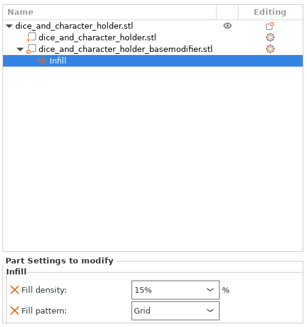
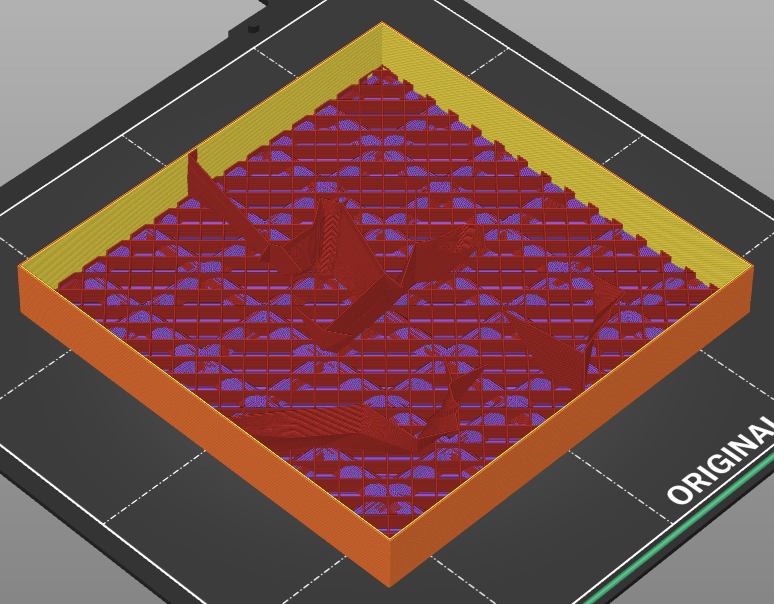
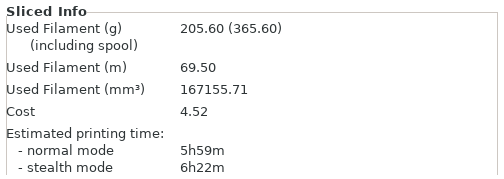
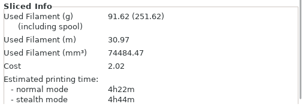
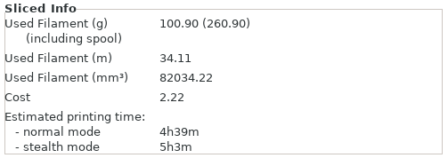

# Betrayal at House on the Hill

This holder is designed for the 3rd edition of the game with a box base measuring 260mm x 260mm x 75mm.

For a full box organizer you need to print the following

- One of each.  If you have a larger bed printer, you may be able to reduce this by generating your own [custom grid](https://github.com/pcon/game_organizer?tab=readme-ov-file#custom-grid).
  - [grid_1](models/grid_1.stl)
  - [grid_2](models/grid_2.stl)
  - [grid_3](models/grid_3.stl)
  - [grid_4](models/grid_4.stl)
- One of each
  - [token_holder_1](models/token_holder_1.stl)
  - [token_holder_2](models/token_holder_2.stl)
  - [token_holder_3](models/token_holder_3.stl)
  - [token_holder_4](models/token_holder_4.stl)
  - [token_holder_5](models/token_holder_5.stl)
  - [token_holder_lid](models/token_holder_lid.stl)
- One of each
  - [dice_and_character_holder](models/dice_and_character_holder.stl)
  - [card_holder](models/card_holder.stl)
  - [figure_holder](models/figure_holder.stl)
- Either two [room_holders](models/room_holder.stl) or one [room_holder_double](models/room_holder_double.stl).  This will depend on your printer size.

## Using `solid` files

The card and room holders have `_solid` variants in [models](models).  These replace the "X" base of the regular model.  These can printed instead if you want to reduce filament usage.  They can be harder to get cards out of but combined with the `basemodifier` files it can dramatically reduce filament usage.

## Using `basemodifier` files

Some of the blocks are large and empty.  This is on purpose to fill up the space to keep the tokens or parts from falling out if the box is rotated.  However, this is a huge waste of filament to print.  To combat this, you can choose a very sparse adaptive infill like Lightning to make most of the part hollow.  However, by default the slicer can leave the bottom "nubbins" very unsupported and this can make it not particularly ridged.  To fix this, you can add modifiers to the parts in your slicer to change the infill.  As an example, with the `dice_and_character_holder.stl` you can use Lightning infill for the main part and then attach a modifier to change the infill for the base.  The modifier can be a STL file.  So by using the `dice_and_character_basemodifier.stl` you can have a more rigid infill like Grid for the "nubbins" and still have the majority of the holder be empty.

Sliced info for full grid infill.

Sliced info for full lightning infill.

Sliced info using `basemodifier` with a grid infill and lightning infill for the rest.
